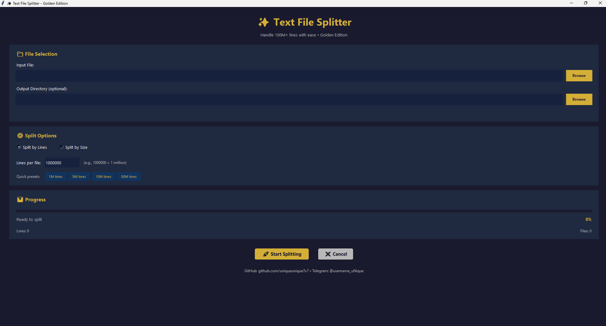

# ✨ Text File Splitter - Golden Edition

A modern, user-friendly GUI application for splitting large text files (100M+ lines) into smaller, manageable chunks. Features a beautiful interface and efficient processing capabilities.


## 📸 Screenshot



*Beautiful interface with intuitive controls and real-time progress tracking*

## 🌟 Features

- **🚀 High Performance**: Efficiently handles files with 100M+ lines
- **💎 Beautiful UI**: Modern interface with intuitive controls
- **📊 Real-time Progress**: Live progress tracking with detailed statistics
- **⚙️ Flexible Splitting**: Split by line count or file size
- **📁 Smart Output**: Automatic output directory creation in script folder
- **🎨 Custom Styling**: Modern design with smooth animations
- **⚡ Quick Presets**: One-click presets for common split sizes (1M, 5M, 10M, 50M lines)
- **❌ Cancellable**: Stop processing at any time
- **📈 Memory Efficient**: Uses buffered reading for optimal performance

## 📋 Requirements

- Python 3.7 or higher
- tkinter (usually comes with Python)
- No additional dependencies required!

## 🚀 Quick Start

### Method 1: Using the Batch File (Easiest)

1. Double-click `run_splitter.bat`
2. The application will launch automatically!

### Method 2: Using Python

1. Open a terminal/command prompt
2. Navigate to the project directory:
   ```bash
   cd c:\xampp\htdocs\Test\Text-Splitter
   ```
3. Run the script:
   ```bash
   python file_splitter.py
   ```

### Method 3: Using PowerShell

```powershell
py file_splitter.py
```

## 📖 How to Use

1. **Select Input File**: Click "Browse" to select your large text file
2. **Choose Output Location** (Optional): Select a custom output directory, or leave blank to use the default (script directory)
3. **Select Split Method**:
   - **By Lines**: Split into files with a specific number of lines each
   - **By Size**: Split into files of a specific size (in MB)
4. **Choose Settings**:
   - Enter custom values or use quick presets (1M, 5M, 10M, 50M lines)
5. **Start Splitting**: Click "🚀 Start Splitting" button
6. **Monitor Progress**: Watch real-time progress, line count, and file count
7. **Open Output**: When complete, choose to open the output folder automatically

## 💡 Examples

### Example 1: Split by Lines
- Input: `large_data.txt` (500M lines)
- Method: Split by Lines
- Lines per file: `10,000,000` (10 million)
- Result: 50 files, each containing 10 million lines

### Example 2: Split by Size
- Input: `wordpress.txt` (2.5 GB)
- Method: Split by Size
- Size per file: `100 MB`
- Result: ~25 files, each approximately 100 MB

## 📁 Output Structure

By default, output files are saved in the script directory with the following structure:

```
Text-Splitter/
├── file_splitter.py
├── wordpress.txt (input file)
└── wordpress_split/ (output folder - auto-created)
    ├── wordpress_part_0001.txt
    ├── wordpress_part_0002.txt
    ├── wordpress_part_0003.txt
    └── ...
```

## 🎨 Features in Detail

### Modern Golden Theme
- Elegant gold and dark navy color scheme
- Smooth hover effects on buttons
- Professional card-based layout
- Responsive design that works on different screen sizes

### Performance Optimizations
- 64MB buffer for file reading/writing
- Efficient memory usage even with huge files
- Progress updates every 100,000 lines to maintain responsiveness
- Multi-threaded processing to keep UI responsive

### Smart File Handling
- UTF-8 encoding with error handling
- Preserves original file extension
- Creates output directory automatically
- Option to open output folder after completion

## ⚙️ Technical Details

- **Language**: Python 3.7+
- **GUI Framework**: tkinter (built-in)
- **Threading**: Multi-threaded for responsive UI
- **Buffer Size**: 64 MB for optimal I/O performance
- **File Naming**: Zero-padded part numbers (e.g., `_part_0001.txt`)

## 🔧 Troubleshooting

### Application won't start
- Ensure Python 3.7+ is installed: `python --version`
- Check if tkinter is installed: `python -c "import tkinter"`

### Output folder not found
- By default, output is saved in the same directory as the script
- Check the success message for the exact output location
- Ensure you have write permissions in the target directory

### Large files processing slowly
- This is normal for extremely large files (multi-GB)
- Monitor the progress percentage and estimated time
- Use the cancel button if you need to stop

### Memory issues
- The application uses buffered reading to minimize memory usage
- For 10GB+ files, ensure you have at least 2GB free RAM

## 📞 Contact & Support

- **GitHub**: [github.com/uniqueunique7x7](https://github.com/uniqueunique7x7)
- **Telegram**: [@username_uNique](https://t.me/username_uNique)

## 📄 License

This project is open source and available under the MIT License.

## 🤝 Contributing

Contributions, issues, and feature requests are welcome!

## ⭐ Show Your Support

If this tool helped you, please give it a star on GitHub!

## 📝 Changelog

### Version 1.0.0 (Current)
- Initial release
- Split by lines or size
- Real-time progress tracking
- Quick presets for common split sizes
- Auto-open output folder option

---

Made with ❤️ by uniqueunique7x7
